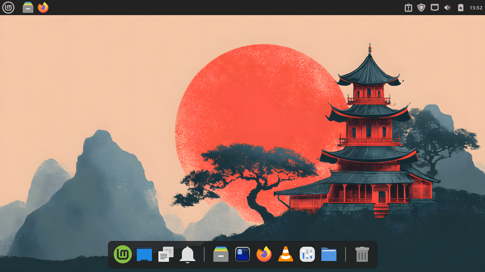

## What Is Plank Reloaded?

Plank Reloaded is a fork of the original [Plank](https://launchpad.net/plank) project, providing a simple dock for X11 desktop environments. We actively support Cinnamon, MATE, Xfce, and KDE.

Like its predecessor, Plank Reloaded aims to be the simplest dock on the planet, providing just what a dock needs and absolutely nothing more. It also remains a library which can be extended to create other dock programs with more advanced features.



## Themes

Plank Reloaded ships with six built-in themes. You can switch themes in **Preferences → Appearance → Theme**.

### Default


### Matte


### Matte Light


### Minimal


### Minimal Light


### Transparent


Plank Reloaded also supports GTK themes. To use one, install it and set it as your default theme, then select **Gtk+** as the Plank Reloaded theme in preferences.

Known compatible GTK themes: [Celestial](https://github.com/zquestz/celestial-gtk-theme) · [Matcha](https://github.com/zquestz/Matcha-gtk-theme) · [Semabe](https://github.com/sewbej/Plank-Themes) · [WhiteSur](https://github.com/vinceliuice/WhiteSur-gtk-theme)

---

## Installation

<details markdown="1">
<summary><strong>Arch Linux</strong></summary>

```bash
yay -S plank-reloaded-git
```

</details>

<details markdown="1">
<summary><strong>Linux Mint / Ubuntu (Noble Numbat)</strong></summary>

**Using the PPA (Recommended):**

```bash
# Add the repository
curl -fsSL https://zquestz.github.io/ppa/ubuntu/KEY.gpg | sudo gpg --dearmor -o /usr/share/keyrings/zquestz-archive-keyring.gpg
echo "deb [signed-by=/usr/share/keyrings/zquestz-archive-keyring.gpg] https://zquestz.github.io/ppa/ubuntu ./" | sudo tee /etc/apt/sources.list.d/zquestz.list
sudo apt update

# Install Plank Reloaded
sudo apt install plank-reloaded
```

**Manual Installation:**

Download the `plank-reloaded.deb` package from the [Releases](https://github.com/zquestz/plank-reloaded/releases) page or build from source:

```bash
sudo apt-get remove plank libplank-common libplank1
sudo apt-get install git meson gettext valac libgnome-menu-3.0 libgnome-menu-3-dev libxml2-utils gtk+-3.0 gee-0.8 libbamf3-dev libwnck-3.0 libwnck-3-dev bamfdaemon
git clone https://github.com/zquestz/plank-reloaded.git
cd plank-reloaded
meson setup --prefix=/usr build
meson compile -C build
sudo meson install -C build
```

</details>

<details markdown="1">
<summary><strong>LMDE / Debian (Bookworm)</strong></summary>

**Using the PPA (Recommended):**

```bash
# Add the repository
curl -fsSL https://zquestz.github.io/ppa/debian/KEY.gpg | sudo gpg --dearmor -o /usr/share/keyrings/zquestz-archive-keyring.gpg
echo "deb [signed-by=/usr/share/keyrings/zquestz-archive-keyring.gpg] https://zquestz.github.io/ppa/debian ./" | sudo tee /etc/apt/sources.list.d/zquestz.list
sudo apt update

# Install Plank Reloaded
sudo apt install plank-reloaded
```

**Manual Installation:**

Download the `plank-reloaded-debian.deb` package from the [Releases](https://github.com/zquestz/plank-reloaded/releases) page or build from source:

```bash
sudo apt-get remove plank libplank-common libplank1
sudo apt-get install git meson gettext valac libgnome-menu-3.0 libgnome-menu-3-dev libxml2-utils gtk+-3.0 gee-0.8 libbamf3-dev libwnck-3.0 libwnck-3-dev bamfdaemon
git clone https://github.com/zquestz/plank-reloaded.git
cd plank-reloaded
meson setup --prefix=/usr build
meson compile -C build
sudo meson install -C build
```

</details>

<details markdown="1">
<summary><strong>Fedora</strong></summary>

**Using RPM Packages (Recommended for X11 users):**

Download the latest RPM packages from the [Releases](https://github.com/zquestz/plank-reloaded/releases) page.

```bash
sudo dnf install ./plank-reloaded-*.rpm
```

**Build from Source:**

```bash
# Set environment variables for X11
GDK_BACKEND=x11
XDG_SESSION_TYPE=x11

sudo dnf install git meson valac clang cmake libgnome-devel libxml2-devel gnome-menus-devel libgee libgee-devel libdbusmenu-gtk3-devel libdbusmenu-gtk3 libwnck3 libwnck3-devel bamf bamf-devel bamf-daemon
git clone https://github.com/zquestz/plank-reloaded.git
cd plank-reloaded
meson setup --prefix=/usr build
meson compile -C build
sudo meson install -C build
```

</details>

<details markdown="1">
<summary><strong>openSUSE</strong></summary>

There is a community supported openSUSE package available at:

[https://build.opensuse.org/package/show/home:asdhio/plank](https://build.opensuse.org/package/show/home:asdhio/plank)

</details>

<details markdown="1">
<summary><strong>FreeBSD</strong></summary>

**Using pkg (Binary Package):**

```bash
pkg install x11/plank
```

**Using the Ports Collection:**

```bash
cd /usr/ports/x11/plank
make install clean
```

For more information about the port, visit [FreshPorts](https://www.freshports.org/x11/plank/).

</details>

<details markdown="1">
<summary><strong>Nix</strong></summary>

There is a Nix flake available. The quickest way to try it:

```sh
nix run github:zquestz/plank-reloaded
```

To build locally:

```sh
nix build github:zquestz/plank-reloaded
```

For system-wide installation with flakes, see the full instructions in the [README](https://github.com/zquestz/plank-reloaded#nix).

</details>

---

## FAQ

<details markdown="1">
<summary><strong>Can I use Plank Reloaded on Wayland?</strong></summary>

No, Plank Reloaded is designed for X11 desktop environments only. Wayland is not supported at this time.

</details>

<details markdown="1">
<summary><strong>How do I access Plank Reloaded preferences?</strong></summary>

Hold Ctrl while right-clicking on any area of the dock to open the Preferences menu.

</details>

<details markdown="1">
<summary><strong>Can I run Plank Reloaded alongside the original Plank?</strong></summary>

No, you should completely uninstall the original Plank before installing Plank Reloaded to avoid conflicts. See the installation instructions for details.

</details>

<details markdown="1">
<summary><strong>How do I auto-start Plank Reloaded when I log in?</strong></summary>

Add Plank Reloaded to your desktop environment's startup applications. The command to use is simply `plank`.

</details>

<details markdown="1">
<summary><strong>Does Plank Reloaded work with multiple monitors?</strong></summary>

Yes, Plank Reloaded works with multiple monitors. To have a dock on each monitor, you need to launch multiple instances with different names:

```bash
plank          # First dock
plank -n dock2 # Second dock
```

Each instance can be configured independently. You can move docks to your active monitor by enabling "On Active Display" in the preferences or by running `killall -USR1 plank`.

</details>

<details markdown="1">
<summary><strong>Why can't I see certain applications in the dock?</strong></summary>

Check if "Restrict to Workspace" is enabled in preferences. When enabled, applications will only show up on the workspace they're active on.

</details>

<details markdown="1">
<summary><strong>Running indicators not showing after login?</strong></summary>

This is typically caused by bamfdaemon not starting properly with systemd.

**Solution 1:** Manually add bamfdaemon to your startup applications. Common paths include:
- `/usr/lib/x86_64-linux-gnu/bamf/bamfdaemon`
- `/usr/lib/bamf/bamfdaemon`

**Solution 2:** Fix the bamf systemd service with a drop-in override:

```bash
mkdir -p ~/.config/systemd/user/bamfdaemon.service.d/
echo -e "[Service]\nRestart=no" > ~/.config/systemd/user/bamfdaemon.service.d/override.conf
systemctl --user daemon-reload
```

</details>

---

## Third Party Docklets

Plank Reloaded supports custom docklets! See the [development guide](https://github.com/zquestz/plank-reloaded/blob/master/DOCKLETS.md) for details.

- [Last.fm](https://github.com/zquestz/lastfm-docklet) - Show recent scrobbles
- [Picky](https://github.com/zquestz/picky) - Advanced color picker
- [Quit](https://github.com/androlekss/quit.git) - Quick access to session actions
- [myIP](https://github.com/androlekss/ip-docklet.git) - Show public IP
- [Volmatic](https://github.com/androlekss/volmatic-docklet.git) - System volume control

---

## Get Involved

- [GitHub Repository](https://github.com/zquestz/plank-reloaded)
- [Report Issues](https://github.com/zquestz/plank-reloaded/issues)
- [Translate on Crowdin](https://crowdin.com/project/plank-reloaded)
- [Development Guidelines](https://github.com/zquestz/plank-reloaded/blob/master/HACKING.md)